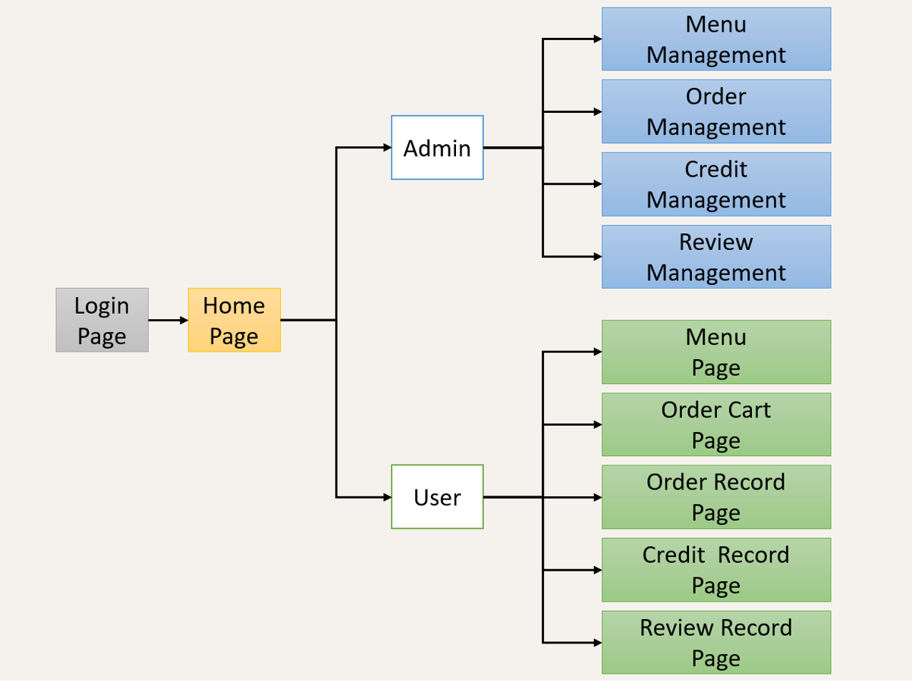

# Meal Provider Front-End

## How to use
```
git clone https://gitlab.winfra.cs.nycu.edu.tw/112-cn/meal-provider-front-end.git
cd meal-provider-front-end/typescript-version
cp .env.example .env
npm install
npm run dev
```


Page View
---
### Share Pages View（Finished)
- [x] Login Page (2024/05/23)
- [x] Home Page (2024/05/23)

### Admin Pages View（Finished）
- [x] Menu Management (2024/05/24)
- [x] Order Management (2024/05/24)
- [x] Credit Management (2024/05/24)
- [x] Review Management (2024/05/24)

### User Pages View（Finished）
- [x] Menu Page (2024/05/25)
- [x] Order Cart Page (2024/05/25)
- [x] Order Record Page (2024/05/26)
- [x] Credit Record Page (2024/05/26)
- [x] Review Record Page (2024/05/26)

Page Function
---

### Share Pages Function
- [ ] Login Page 
- [ ] Home Page

### Admin Pages Function
- [ ] Menu Management
- [ ] Order Management
- [ ] Credit Management
- [ ] Review Management

### User Pages Function
- [ ] Menu Page 
- [ ] Order Cart Page 
- [ ] Order Record Page 
- [ ] Credit Record Page 
- [ ] Review Record Page 


Other
---
### account
 - Admin
    - Email: admin@gmail.com
    - Pass: hello
 - user 
    - Email: user@gmail.com
    - Pass: hello

### 開發記錄
- 2024/05/25
   - 搞了整天的 route 還是沒看懂，因為 next.js 的 route 和 auth 都做在 SSR，下一次有空再用 route， 我先做其他 page
   - next.js 有些東西寫在 CSR 一些在 SSR，不是很好理解
   - 前後端分離的設計不是很適合
- 2024/05/26
   - Template 的很多 button 都沒有功能，所以有用到的要自己去實作，template 就只是提供 UI